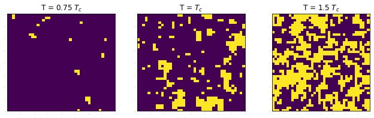
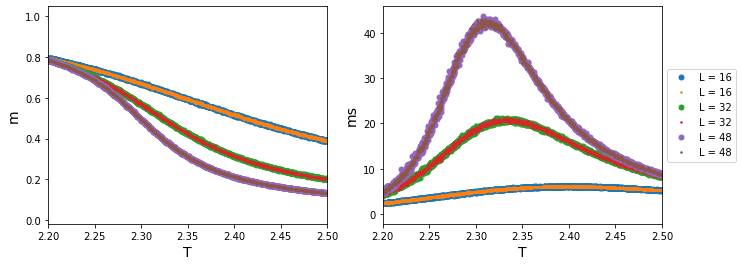
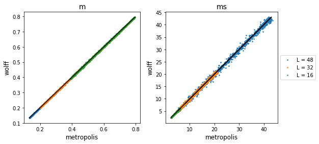
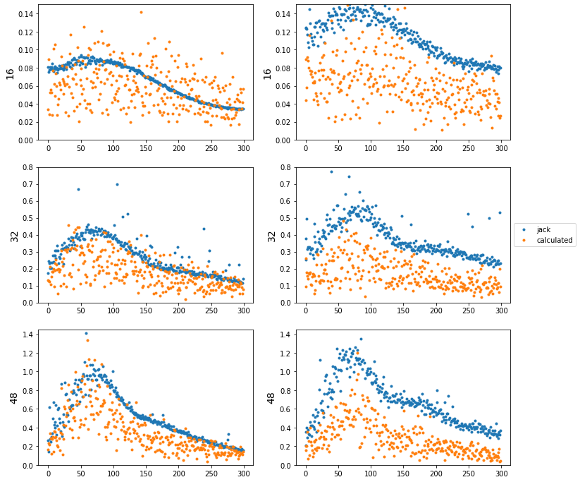
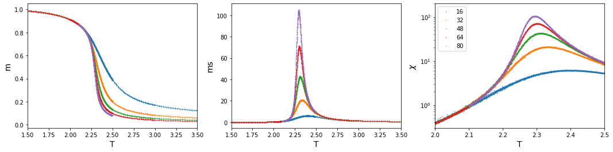
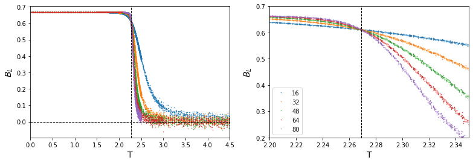
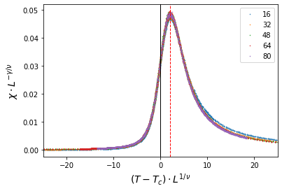
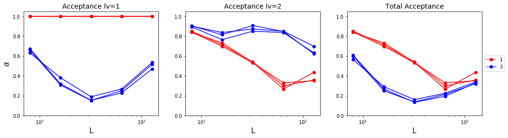

# I. Introduction

#### 1. Monte Carlo simulation on  [Ising model](https://en.wikipedia.org/wiki/Ising_model).

> Here, I'll discuss about square lattice spin-1/2 simple classical Ising model.

​	For this Ising model, the energy configuration of the state $\{s_i\}$ is given by Hamiltonian,  
$$
H = -J\sum_{<i,j>} s_is_j- B\sum_i s_i
$$
where $<i,j>$ means the nearest neighbor in lattice site, and $s_i = \pm 1$. 
	This model is the simplest model of a magnet. $J$ indicates the interaction between nearest neighbors. It is ferromagnetic for $J>0$, and anti-ferromagnetic for $J<0$. ($B$ stands for external magnetic field, which I will set as $0$.) Ising model has a critical point (second-transition point), and I'm going to invest some special thermal properties that locate critical point.



There exist some exact solutions for 1 or 2-dimension lattice, however, I'm going to examine this model on finite sizes using Monte Carlo simulation by C++. 

#### 2.  Self learning Monte Carlo method

​	For the classical Ising model, there exists a global update (e.g. cluster update) that reduces auto-correlation time successfully. However, for other sophisticated models, we can only apply a local update, and it is extremely slow near a critical point. By the self-learning Monte Carlo method, we can figure out a faster global update for any model given by Hamiltonian. 

# II. Background

​	I'll discuss some thermodynamic and statistical backgrounds as well as Monte Carlo methods. Also, I'll briefly talk about some solutions for the Ising model in various dimensions.

## 1. Thermodynamics & Statistical physics
### 1.1. Partition function
 	[Partition function](https://en.wikipedia.org/wiki/Partition_function_%28statistical_mechanics%29) contains important information for a given system. 
$$
Z = \sum_{\{s\}}\exp(-\mathcal{H}(s)/kT), \; \mathcal{H} \text{ : Hamiltonian}
$$
 By using $Z$, we can drive some important physical quantities. 

- Probability of state: $P_s = \exp(-\mathcal{H}(s)/kT)/Z$

Knowing this function is about knowing everything in this system. I'll talk about it below section 1.2.

However, it is usually hard to get exact function when the system size increases, as we cannot sum all existing states. By conducting Monte Carlo method(section 1.3), we could obtain this function quite accurately.
### 1.2. Free energy
[	Helmholtz free energy](https://en.wikipedia.org/wiki/Helmholtz_free_energy) of a system is given by $$\mathcal{F} = -kT\ln Z$$ and other thermodynamic quantities can be obtained by simply calculation. As $\mathcal{F} = U - TS$, 
$$
\begin{aligned}

d\mathcal{F} &= dU - TdS -SdT 
\\ &= (TdS-PdV+\mu dN) -TdS-SdT
\\ &= -SdT - PdV+\mu dN

\end{aligned}
$$
Which implies 

$$S = -\left(\frac{\partial \mathcal{F}}{\partial T}\right)_{V, N}, P = -\left(\frac{\partial \mathcal{F}}{\partial V}\right)_{T, N}, \mu = -\left(\frac{\partial \mathcal{F}}{\partial N}\right)_{T, V}$$ 

Moreover, using these, we can obtain order parameters. Here, $\beta = kT$.
$$
U = -\frac{1}{Z}\frac{\partial Z}{\partial\beta} = -\frac{\partial}{\partial\beta}\ln Z = -T^2 \frac{\partial (\mathcal{F}/T)}{\partial T} = \langle E \rangle
\\ \begin{aligned} C &= T \frac{\partial S}{\partial T} = -\beta \frac{\partial S}{\partial \beta}= \frac{\partial U}{\partial T} = k\beta^2 \frac{\partial^2}{\partial \beta^2}\ln Z \\&=k\beta^2\left(\frac{1}{Z}\frac{\partial^2}{\partial\beta^2}Z - \left[ \frac{1}{Z}\frac{\partial}{\partial \beta}Z\right]^2\right) =k\beta^2(\langle E^2\rangle - \langle E\rangle^2) \end{aligned}
\\M = \frac{\partial \mathcal{F}}{\partial B} = \left\langle \sum_i s_i \right\rangle, \;\; \chi = \frac{\partial\langle M\rangle}{\partial B} = \beta (\langle M^2\rangle - \langle M \rangle ^2)
$$

where $U$ is internal energy, $C$ is [specific heat capacity](https://en.wikipedia.org/wiki/Specific_heat_capacity), $M$ is [magnetization](https://en.wikipedia.org/wiki/Magnetization), and $\chi$ is [magnetic susceptibility](https://en.wikipedia.org/wiki/Magnetic_susceptibility). So by knowing the partition function, we could derive almost all quantities that we need.

## 2. Some solution of classical Ising model[^2]

### 2.1. Exact solution for 1-dimension Lattice

​	Consider 1-dimensional Ising model of periodic boundary that has $N$ sites. Given Hamiltonian, the partition function is
$$
\begin{aligned}
Z =& \sum_{\{\vec{s}\}}\exp(\beta J (s_1s_2 + \cdots + s_N s_1)+ \beta B(s_1+\cdots+s_N))
\\=& \sum_{\{\vec{s}\}}\exp(\beta J (s_1s_2 + \cdots + s_N s_1)+ \frac{1}{2}\beta B((s_1+s_2)+\cdots+(s_N+s_1))
\\=& \sum_{\{\vec{s}\}}\underbrace{\exp(\beta Js_1s_2+\frac{1}{2}\beta B(s_1+s_2))}_{\langle s_1|T|s_2\rangle}\cdots\underbrace{\exp(\beta Js_Ns_1+\frac{1}{2}\beta B(s_N+s_1))}_{\langle s_N|T|s_1\rangle}
\\=& \sum_{s_1}\cdots\sum_{s_N}\langle s_1|T|s_2\rangle\cdots\langle s_N|T|s_1\rangle = \sum_{s_1}\langle s_1|T|s_1\rangle = \text{Tr}(T^N) = \sum\lambda_i^N
\end{aligned}
$$
The $T$ part acts like a matrix, as each spin is either $1$ or $-1$. 
$$
T = \begin{array}{c|cc}s_i, s_{i+1}&+1 & -1 \\\hline
+1 & e^{\beta(J+B)} & e^{-\beta J}
\\-1 & e^{-\beta J} & e^{\beta(J-B)}
\end{array}
$$
This matrix has eigenvalue of 
$$
\lambda = e^{\beta J}\cosh \beta B\,\pm\sqrt{e^{2\beta J}\cosh^2\beta B-2\sinh2\beta J} 
$$
For $B=0$, $\lambda = e^{\beta J}\pm e^{-\beta J}$. Using this, we can calculate free energy and internal energy each.
$$
\mathcal{F} = -kT\ln Z = -\beta N\ln 2\cosh\beta J
\\ U = -\frac{\partial}{\partial \beta}\ln Z = -JN\tanh\beta J
$$

### 2.2. Mean Field theory for d-dimension Lattice

From same Hamiltonian above, we'll discover partition function using mean field theory. 

First, let $s_i = \langle s\rangle+\delta s_i, \; s_j = \langle s\rangle +\delta s_j$, and put into Hamiltonian.
$$
\begin{aligned}
\mathcal{H} =& -J\sum_{\langle i,j\rangle}s_is_j - B\sum_i s_i = -J\sum(\langle s\rangle+\delta s_i)(\langle s\rangle+\delta s_j)-B\sum s_i 
\\=& -J\sum_{i,j} (\langle s\rangle^2+\langle s\rangle(\delta s_i+\delta s_j))-B\sum s_i=-J\sum (\langle s\rangle(s_i+s_j)-\langle s\rangle^2)-B\sum s_i
\\=& -2zJ\sum_i(\langle s\rangle s_i-\langle s\rangle^2)-B\sum s_i \;\;(z: \text{# of nearest neighbor})

\\Z =&\sum_{\{\vec{s}\}}\prod_i^N\exp\left(\frac{1}{2}\beta z J\langle s\rangle s_i+\beta B s_i\right)\exp(2\beta z J N\langle s\rangle^2)
\\=& \prod_i^N 2\cdot\frac{1}{2}\left(\exp(\frac{1}{2}\beta z J\langle s\rangle+\beta B)+\exp(-\frac{1}{2}\beta z J\langle s\rangle-\beta B)\right)\exp(2\beta z J N\langle s\rangle^2)
\\=& 2^N\cosh^N\left(\frac{1}{2}\beta z J\langle s\rangle +\beta B\right)\exp(2\beta z J N\langle s\rangle^2)^N
\\ P =& \exp(-\beta\mathcal{H}_i)
\\ \langle s\rangle =& \frac{\sum s_i P_i}{N\sum P_i} = -\frac{1}{N\beta}\frac{\partial \ln Z}{\partial B} = \tanh(1/2\,\beta zJ\langle s\rangle +\beta B)
\end{aligned}
$$
Large $\beta$ will cause 2 stable point of $\langle s\rangle\neq 0$ and 1 unstable point $\langle s\rangle=0$. For small $\beta$, $\langle s\rangle=0$ is the stable point. The point of transition will be the transition point, which is $T_c = z/2$ with dimension $J/k$.

Mean-field theory is quite correct at higher dimensions, however, deviates far from exact solution in dimensions of 1 or 2.

## 3. Markov Chain Monte Carlo

​	Above, I explained that the exact partition function is difficult to figure out, however, by statistical Monte Carlo simulations, solving these functions are available. Generally, we use a **Markov chain**. It requires careful design, as it must satisfy some properties.

### 3.1. Markov Chain (MC)[^6]

The first-order Markov chain only depends on the last previous state(conditional probability) and can be described by transition function.
$$
p(x^{(k+1)}|x^{(1)}, \cdots,x^{(k)}) \equiv p(x^{(k+1)}|x^{(k)})\equiv T_k(x^{(k)}, x^{(k+1)}), \;\text{where }k\in 1, \cdots,M
$$
This chain is homogeneous if  $\forall i, j, \,T_i = T_j$.

A distribution is invariant/stationary when a transition function of the chain leaves the distribution unchanged, i.e.
$$
p^*(x) = \sum_{x'}T(x', x)p^*(x')
$$
Designing a transition operator that makes distribution stationary is important in our case. The transition operator satisfies **detailed balance** by
$$
p^*(x)T(x, x') = p^*(x')T(x', x)
$$
If this detailed balance is satisfied, the distribution is stationary under $T$.

Moreover, if the distribution $p(x^{(k)}|x^{(0)})\to p^*(x)$ (invariant) when $k\to\infty$, then the chain has property **ergodicity**. A poorly designed operator might divide a set into certain states. That is, the distribution can reach any state after a long time from any state. 

### 3.2. Application: update

In general, the transition operator from $a$ to $b$ is given by $T(a\to b) = A(a\to b)q(b|a)$.

#### 3.2.1. Local update: Metropolis-Hastings algorithm

We want to obtain $x^{(1)}\mapsto x^{(2)}\mapsto \cdots\mapsto x^{(m)}\cdots$. First, initialize, $\tau=1, \, x^{(\tau)}=?$

​	a. Propose $x^*\sim q(x^*|x^{(\tau)})$

​	b. Accept $x^*$ with an acceptance ratio $A(x^{(\tau)}\to x^*) = \min\left(1, \frac{p(x^*)q(x^{(\tau)}|x^*)}{p(x^{(\tau)})q(x^*|x^{(\tau)})}\right)$

​	c. If accepted, $x^{(\tau+1)} = x^*$. Else, $x^{(\tau+1)} = x^{(\tau)}$.

​	d. Repeat the above steps.

In our local update, a proposal is given by $q(b|a) = \text{constant}$. I'll briefly explain the scheme of this algorithm.

1. Define lattice size ($L$) and nearest-neighboring index. Initialize each spin site randomly or like chess-board; which has maximum energy level. (This will prevent super-cooling.)

   The nearest-neighboring index array will contain information of periodic boundary condition.

2. Define Monte-Carlo-one-step(**1 MC-step**) as following:

   * pick one spin site (randomly or checkerboard-style) and flip it. 
   * Calculate the energy difference ($=\Delta \mathcal{H}$).
   * If energy difference less than 0, accept the spin-flip. Else, accept it by the probability of $\exp(\Delta\mathcal{H}/kT)$. 
   * Perform the above steps for the whole spin site; which will be $L^2$.

3. Calculate important thermodynamic quantities:
   * Before calculation, perform 2000~2500 MC-steps to obtain an accurate value.
   * Calculate magnetization and energy for 10000 times. For each data, throw a few steps according to the autocorrelation time. (e.g. Metropolis: $\theta \sim L^2$, Cluster: $\theta \sim L^{0.44}$) Without this throwing process, we will experience a certain bias of the observed value.
   * Calculate magnetization, magnetic susceptibility, energy, specific heat...etc.

4. Do the above steps for each temperature. Invest some quantities near the critical point.

#### 3.2.2. Global update: Cluster update[^5]

​	Well-known local updates such as Metropolis update takes tremendous time and large autocorrelation between each state. We'll propose the most successful global update method, which is a cluster update. There are some fundamentals(**Fortuin-Kasteleyn cluster decomposition**) to discuss before explaining the algorithm.

First, let $\mathcal{H} = -\sum_{\langle i, j\rangle}s_is_j$ and $Z = \sum_{\{s\}}e^{-\beta \mathcal{H}}$. 

Remove interaction between fixed nearest-neighboring site of $\langle l, m\rangle$ : $\mathcal{H} _{l,m} = -\sum_{\langle i, j\rangle\neq \langle l, m\rangle} s_is_j$

Define new partition function, considering rather $s_i, s_j$ are same or different.

$$Z_{l, m}^{=}=\sum_{\{s\}}\delta_{s_l, s_m}e^{-\beta \mathcal{H}_{l, m}}, \; Z_{l, m}^{\neq}=\sum_{\{s\}}(1-\delta_{s_l, s_m})e^{-\beta \mathcal{H}_{l, m}}$$

The original partition function is $Z = e^\beta Z_{l, m}^=+e^{-\beta}Z_{l, m}^\neq$. 

Moreover, define $Z_{l, m}^{indep.} = \sum e^{-\beta \mathcal{H}_{l,m}} = Z_{l,m}^=+Z_{l,m}^\neq$, then partition function $Z = (e^\beta-e^{-\beta})Z_{l,m}^=+e^{-\beta}Z_{l,m}^{indep.}$

Since $Z^=$ contains only when $s_l=s_m$, and $Z^{indep.}$ contains no restriction for spin-links, the weighing factors can be considered as probabilities of bond between site $l, m$. 

$$p_{bond} = 1-e^{-2\beta}, \;Z = \sum p^b(1-p)^n 2^N$$

By using the above probability, one can create a cluster for a simple Ising model.

I'll introduce **Wolff-cluster update**, which has proposal $q(b|a)/q(a|b) \equiv p(b)/p(a)$. (And has acceptance ratio $=1$.)

1. Choose a random site $i$, and select nearest-neighbor $j$.
2. If $s_i =s_j$, bond to cluster with probability $p = 1-e^{-2\beta J}$.
3. Repeat step 1 for site $j$, if it was in the cluster. Keep until no more bond is created.
4. Flip the entire cluster.

```c++
// na = neighbor index array
int i = size*size * dis(gen);
int sp = 0, sh = 0;
double point;
double prob = 1 - exp(-2*J/T);
double oldspin = v[i], newspin = -v[i]; 
vector<int> stack(size*size, 0);
stack[0] = i; search[i] = 1; v[i] = newspin;
while (1) {
	for (int k = 0; k < 4; k++){
		point = na[i][k];
		if (v_[point] == oldspin && dis(gen) < prob) { 
			sh++; 
			stack.at(sh) = point;
			v[point] = newspin; 
		}
	}
}
```

# III. Method

> c++: parameters, steps, throwing steps

​	To analyze this model, we need to calculate thermodynamic quantities for each temperature. There are some interesting results in differing sizes of the system. I'll introduce the mechanics of analyzing the Ising model. 

## 1. Ising model Analysis

### 1.1. Finite size scaling: critical exponent[^4]

​	For the finite-size system, the phase transition is smooth and inaccurate, which needs some additional interpretation. For each pseudo-critical temperature at a certain size, we can guess the accurate critical temperature. Usually, a genuine value of critical point can only be obtained from an infinite system.

We can find a singular point of free energy. This can be expressed as a function of size and temperature.
$$
F(L, T) = L^{(a-2)/\nu}\mathcal{F}((T-T_c)L^{1/\nu})
$$
Calculation from free energy, we have nice scaling factors.
$$
M = L^{-\beta/\nu} \tilde{M}((T-T_c)L^{1/\nu})
\\ \chi = L^{\gamma/\nu}\tilde{\chi}((T-T_c)L^{1/\nu})
\\ C = L^{\alpha/\nu}\tilde{C}((T-T_c)L^{1/\nu})
$$
Ising model's [critical exponents](https://en.wikipedia.org/wiki/Ising_critical_exponents) are known as $\alpha = 0,\; \beta = 1/8,\; \gamma = 7/4,\; \nu = 1$. Moreover, $T_c=2/\ln(1+\sqrt{2})\simeq2.2692 $. 

Here, I'm scaling using $\chi$. 

​	Plot $(T-T_c)L^{1/\nu}$ versus $\chi L^{-\gamma/\nu}$ to draw function $\tilde{\chi}$, and find the maximum point $y_{max}$. At this point, we can figure out real critical temperature by $y_{max} = (T_{L}-T_c)L^{1/\nu}$ ($T_{L}$: pseudo-critical point at size $L$.)  Plotting $L^{-1/\nu}$ versus $T_L$ will predict the real critical temperature.

#### + [Binder cumulant](https://en.wikipedia.org/wiki/Binder_parameter) $B_L$

​	By examining higher order, we can invest $T_c$ more precisely. 

$$B_L = 1 - \frac{\langle m^4\rangle}{3\langle m^2\rangle^2}$$

As system size goes to infinity, $B_L\to0$ for $T>T_c$  and $B_L\to2/3$ for $T<T_c$. This quantity shows clear convergence near critical point. 

### 1.2. Error analysis: Jack knife[^5]

​	As we calculate functions which has a dependency on the previous state(~autocorrelation), normal calculation of error doesn't work. We have to implement a new error-analyzing method for a given quantity $x$. 

1. Calculate average $\langle x\rangle$. 
2. Divide data into $k$ blocks (called binning); block size must be bigger than the autocorrelation time, to eliminate the impact of correlation.
3. For each block $i = 1, \cdots, k$, calculate $x^{(i)} = \frac{1}{k-1} \sum_{j\neq i} x_j$
4. Estimate error: $\delta_x^2 = \frac{k-1}{k}\sum_{i=1}^k (x^{(i)}-\langle x\rangle)^2$

As this method slices data into several blocks, its name is Jack knife. In general, the error estimated from Jack knife method is larger than the normal error (standard deviation, usually.) Jack knife error usually $\tau_{int}$ times larger than the calculated error.

### 1.3. Autocorrelation time [^7]

​	The autocorrelation function is the correlation of some parameter $X$ with delayed-itself as a function of time. 
$$
\langle X(0) X(t)\rangle - \langle X\rangle ^2 = C(t) = \frac{1}{N-t}\sum_{n=1}^{N-t}(X_n - \langle X\rangle)(X_{n+t}-\langle X\rangle) \sim e^{-t/\tau_{exp}}
$$
For error analysis, we usually use **integrated autocorrelation time**.
$$
\tau_{int} = \frac{1}{2} + \sum_{t=1}^\infty C(t)\lesssim \tau_{exp} \;(\sim \text{for pure exponential function})
$$
By fast Fourier transformation (FFT), we can sum up the values in reduced time. Calculating the integrated autocorrelation time of the given parameter takes only $O(\log N)$ time.

## 2. Self Learning update method [^8]

​	The local update is the most general one, that can be performed on any model, but very slow and inefficient. On the contrary, the global update is the most preferred one due to its speed and efficiency, but can only be applied on specific models. In this paper, the author developed some global update method using self-learning by linear regression. The brief outline follows:

1. Perform original local update using Metropolis-Hastings algorithm to make training data.

   * The data contains the energy of spin configuration, nearest-neighbor correlation, next-nearest-neighbor correlation, and third-nearest-neighbor correlation. I'll also vary the number of data for training. ($2^{10}, 2^{11}, 2^{12}$)

2. Learn effective Hamiltonian from this data: Using linear regression on energy and spin-correlations.

   * effective Hamiltonian $$\mathcal{H}_{eff} = E_0 - \sum_{k=1}^n \left( J_k\sum_{\langle i,j\rangle_k}s_is_j \right)$$: I'll only consider case $n=1$ and $n=3$. 

   * Linear regression: Using python numpy library, $E_0$ and $\{J_i\}$ is calculated from given training data.

     ```python
     Jlist, err, _, _ = np.linalg.lstsq(target_mat, E_0, rcond=None)
     ```

3. Propose a move according to effective Hamiltonian, i.e. **create a cluster** using $\mathcal{H}_{eff}$.

   * Two different cluster-formation is elaborated below. (section 2.1 & 2.2)

4. Determine whether the proposed moves(=cluster) will be accepted(=flipped), using original Hamiltonian. The acceptance ratio is given by
   $$
   A_s(a\to b) = \min\left(1, \frac{p(b)q(a|b)}{p(a)q(b|a)}\right) = \min\left(1, \frac{p(b)p_{eff}(a)}{p(a)p_{eff}(b)}\right) = \min(1, \exp(-\beta[(E_b-E_b^{eff})-(E_a-E_a^{eff})]))
   $$

However, it is not over yet. We must obtain training data from a critical point, where the local update perform poorly. 

​	a. Perform step 1 to get initial training data at temperature higher than critical point, s.t. $T_i=T_c+2$, and perform step 2.

​	b. By obtained effective Hamiltonian, create next training data by doing step 3 and 4 at $T<T_i$. Perform step 2 again.

​	c. Repeat 'step b' until the temperature reaches point $T_c$.

Lastly, by derived effective Hamiltonian, we will compare this with the original Hamiltonian, for diverse temperature range.


​	To form a cluster considering only nearest-neighbor($J_1$) is simple, which is just a Wolff cluster method. However, to consider next-nearest-neighbors($J_2$) and third-nearest-neighbors($J_3$) is a complex problem. I've considered two methods to solve this problem.

### 2.1. Consideration of nth-Nearest-Neighbor(nth-NN) during formation of cluster

​	The first method is by including $J_2$ and $J_3$ correlation directly during the construction of the cluster. The brief scheme of this algorithm is to search the $J_2, J_3$ correlation inside the cluster. This method goes similar to Wolff cluster, however, in the interval, it considers 2nd-NN and 3rd-NN.  

1. Choose a random site $i$. Select the nearest neighbor of $i$, call it $j$. 
2. Search for 2nd-NN and 3rd-NN for $j$ , inside the cluster. The number of 2nd-NN and 3rd-NN inside the cluster is each denoted by $n_2, n_3$. The probability to bond site $j$ is  $p = 1 - \exp(-2\beta (J_1+n_2J_2+n_3J_3))$.
3. Repeat step 1 for site $j$, if it was in cluster. Keep until no more bond is created.
4. This cluster will be flipped by considering the acceptance ratio of $A_s$ above.

The key point of this cluster formation is the consideration of 2nd-NN and 3rd-NN inside bond-probability. 

```c++
// Front line same as Wolff cluster...
vector<int> search(size_*size_, 0);
stack[0] = i; search[i] = 1;
while (1) {
	for (int k = 0; k < 4; k++){ 
		p = na[i][k]; 
		n2 = search[na[p][4]] + search[na[p][5]] + search[na[p][6]] + search[na[p][7]]; //J2
		n3 = search[na[p][8]] + search[na[p][9]] + search[na[p][10]] + search[na[p][11]]; //J3
		prob = padd_[5*n2+n3]; // Define probability before, and reference it.
		if (prob>0){
			if (v_[point] == oldspin && dis(gen) < prob) { 
				sh++; 
				stack.at(sh) = point; 
                search[point] = 1; 
                // 'search' array has value 1 at the location of cluster.
				v[point] = newspin; 
		}
	}
}
/* ... : Accept this flip by considering Self-Learning acceptance operator. */
//Finished.
```

### 2.2. Change acceptance ratio of cluster flipping

​	The second method is to change the acceptance ratio; form a cluster regarding  $J_1$ correlation, and accept/reject this cluster flip by considering $J_2, J_3$ correlation. This method was inspired by the shift of acceptance ratio during self-learning.

1. Construct Wolff-cluster using only information about 1st-NN, as normal. This step is identical to Wolff-cluster formation.

2. Accept this cluster flip regarding given Hamiltonian, which includes 2nd-NN and 3rd-NN.
   $$
   A^*(a\to b) = \min\left(1, \frac{p(b)q(a|b)}{p(a)q(b|a)}\right) = \min\left(1, \frac{p(b)p_{J_1}(a)}{p(a)p_{J_1}(b)}\right) = \min(1, \exp(-\beta[(E_b-E_b^{J_1})-(E_a-E_a^{J_1})]))
   $$
   Where $E^{J_1}$ implies the effective energy calculated using only 1st-NN. This step is similar to self-learning acceptance operator. 

3. This cluster flip will again be accepted or rejected regarding $A_s$ above.

For the overall acceptance ratio of cluster,
$$
A(a\to b) = \min\left(1, \frac{p(b)p_{eff}(a)}{p(a)p_{eff}(b)}\min\left(1, \frac{p_{eff}(b)p_{J_1}(a)}{p_{eff}(a)p_{J_1}(b)}\right)\right)
$$
where $p$ stands for original Hamiltonian that we are interested in, $p_{eff}$ for effective Hamiltonian, and $p_{J_1}$ for effective Hamiltonian of 1st-NN.

```c++
vector<double> v = array; // array: given spin configuration
/* ... : Cluster formation on v */
double ediff1, ediff2; // Two level operator
ediff1 = ((eff_E(v, J, nth) - eff_E(v, J, 1)) 
          - (eff_E(array, J, nth) - eff_E(array, J, 1))) / T; 
// If cluster flip accepted by effective Hamiltonian, go to next step!
if (ediff1 <= 0 || (dis(gen) < exp(-ediff1)) { 
	ediff2 = (((original_E(v, K) - eff_E(v, J, nth)) 
               - (original_E(array, K) - eff_E(array, J, nth))) / T;
    // If cluster flip is accepted by original Hamiltonian, flip!
	if (ediff2 <= 0 || (dis(gen) < exp(-ediff2)) { array = v; } 
	}
//Finished.
```


​	To test whether these two methods are acceptable, I performed cluster-formation and compared it to Metropolis algorithm, using below Hamiltonian. (This is because Metropolis algorithm can be applied to any model.)
$$
\mathcal{H} = -\sum_{k=1}^2\sum_{\langle i,j\rangle_k}J_k s_is_j, \,\text{where } J_1 = 1, \, -0.15<J_2<0.15
$$
 

​			*Comparison of metropolis update and cluster update using method 2.1 and 2.2*

| R square | -0.15      | -0.05      | 0.05       | 0.15       |
| ----------- | -- |--  |--  |--  |
| method: 2.1 | 0.84273832 | 0.99276231 | 0.99497835 | 0.95549145 |
| method: 2.2 | 0.99684442 | 0.99996033 | 0.99996566 | 0.99994447 |

As $J_2$ deviates from $0$, method 2.1 diverges from the original value. This implies the detailed balance of this system has not been satisfied.

The above table shows the R$^2$-value. In this next-nearest-model, it is clear that the method of changing the acceptance ratio works better. However, I'll perform both methods on self-learning, and then compare these two.

# IV. Result & Discussion

## 1. Classical Ising model

​	To begin with, the classical Ising model of 
$$
H = -\sum_{<i,j>} s_is_j
$$
is used in this section. First, a comparison between local/global update was conducted. For the next step, an examination of some important quantities of different sizes was done.

### 1.1. Comparison of Local & Global update: $m, \chi$

​	A local update was performed using the Metropolis algorithm, and the global update was by the Wolff cluster algorithm. I have calculated the accuracy of the global update, and the efficiency of the global update compare to the local update.

#### 1.1.1. R square

System size 16, 32, 48 was used to compare R square.



*Magnetization and Magnetic susceptibility comparison: (big) Metropolis (small) cluster*



*(left) m(T) comparison (right) $\chi$(T) comparison*

We can conclude that the Wolff cluster algorithm works just as well as the Metropolis algorithm. We can conclude the Wolff method is also reliable.

#### 1.1.2. Error comparison



The orange dots are error calculated from the Metropolis, and blue ones are error from the clustering algorithm. There is a clear relation between autocorrelation time and the error obtained by jack knife; metropolis error was much bigger than cluster error, and also, error at the critical point was largest among given temperature range. 

#### 1.1.3. Integrated Autocorrelation time

​	System size of 8, 16, 32, 64, 128 was used here to compare autocorrelation. Parameter such as magnetization and magnetic susceptibility was used to calculate integrated autocorrelation time for each algorithm. The calculation was on a critical point, which has the worst autocorrelation.

Starting with magnetization autocorrelation time,

| Autocorrelation |              Metropolis              |               Cluster                |
| :-------------: | :----------------------------------: | :----------------------------------: |
|    function     | .png) | .png) |
| integrated time | .png)  | .png)  |

Below graphs shows $\tau_{int}\sim L^z$. ($z = 0.44479$ for cluster, $z =  2.00119$ for metropolis.)

.png)

​	Moreover, I calculated the integrated autocorrelation time for magnetic susceptibility. ($z = 0.33127$ for cluster, $z = 2.0587$ for metropolis.)

.png)

Cluster algorithm works much better than the Metropolis one. Autocorrelation time for Metropolis diverges faster than the clustering algorithm. At system size 128, it gets terribly inefficient. As the clustering algorithm has less autocorrelation time, we can throw fewer steps to obtain results that we need. For these reasons, I'm going to use the Wolff cluster method for investing the Ising model's finite size effect.

### 1.2. Comparison of Lattice size

System size of 16, 32, 48, 64, 80 was used here to investigate finite-size effects. Here, results were received by conducting a cluster update.

#### 1.2.1. Thermodynamic quantities

​	Overall, magnetization was used here to calculate some quantities, such as magnetic susceptibility and Binder cumulant of magnetization.



*(left) Magnetization by different size (center) Magnetic susceptibility (right) Magnetic susceptibility in log scale*

Obviously, as size increases, the more it acts as an infinite size. Magnetization drops exponentially at a critical point. Also does magnetic susceptibility. As the size grows, magnetic susceptibility diverges at a critical point. However, we can figure out some subtle critical-temperature shifts as varying system size. To accurately obtain a critical point, we must perform some other analysis. 

#### 1.2.2. Binder cumulant using $m$



The vertical dashed line (--) represents the critical temperature, where $T_c = 2/\ln(1+\sqrt(2))\simeq2.2692$. At critical point, Binder value converges. 

#### 1.2.3. Finite size scaling using $\chi$



The value of maximum y position(red dashed line): 1.968705

The above result shows that the well-known critical exponents of the Ising model match exactly with our model, which implies our simulation is successful. 

.png).png)

To obtain genuine critical temperature, we must do 'finite size scaling' from each pseudo-critical values.

(left) The plot shows the linear fitting curve. The $y$-intercept of these lines indicates the predicted critical temperature.

* include all points:  $2.053837x+2.268260$
* exclude point $L=16$:  $2.059052x+2.268162$
* exclude point $L=16, 32$:  $1.430204x+2.277027$

(right) By considering some standard deviation and errors, we could conclude that the critical temperature is about $T_c = 2.268 \pm 0.004$. Our result deviates only 0.0012 from well-known value.

## 2. Self Learning Monte Carlo method

> SLMC on plaquette-Ising model: E vs T, E vs E_eff
>
> Compare effective Hamiltonian of n=1 and n=3.

​	I'll mainly perform self-learning on plaquette-Ising model, which is
$$
\mathcal{H} = -J\sum_{\langle i, j\rangle}s_is_j-K\sum_{ijkl\in\Box}s_is_js_ks_l
$$
I'll focus on the case where $K/J = 0.2$. (Both positive and ferromagnetic.)

.png) 

By performing Metropolis-Hastings algorithm on a plaquette-Ising model of system size 10, 20, and 40, we assume that $T_c = 2.493$, demonstrated by the following paper.

First, I have performed Metropolis algorithm for fitting plaquette Hamiltonian (I'll call this *original Hamiltonian*) into effective Hamiltonian $\mathcal{H} = -\sum_{k=1}^{nth}\sum_{\langle i,j\rangle_k}J_k s_is_j$, differing the size of training data $2^{10}$~$2^{12}$. 

.png)

| R square    | $2^{10}$           | $2^{11}$           | $2^{12}$ |
| ----------- | ------------------ | ------------------ | -------- |
| $J_1$       | 0.9977622159345134 | 0.9979367589474513 |          |
| $J_1$~$J_3$ | 0.997696360155469  | 0.9979543930109472 |          |

Indeed, considering 3rd-NN during fitting (i.e. fitting to $J_3$) is usually more accurate, however, it does not seem to have big difference. Considering only $J_1$ in this case also works well.

### 2.1. Compare Two methods:

#### 2.1.1. Consideration of nth-NN on formation of cluster

.png)

.png)

| R square | $2^{10}$           | $2^{11}$           | $2^{12}$           |
| -------- | ------------------ | ------------------ | ------------------ |
| 1st-NN   | 0.9996268876183921 | 0.9997928031923388 | 0.9998775706675226 |
| 3rd-NN   | 0.966586965517033  | 0.9691316899978449 | 0.9712051149363949 |

| effective Hamiltonian | J1              | J2                | J3               |
| --------------------- | --------------- | ----------------- | ---------------- |
| 1st-NN                | 1.112$\pm$0.001 | .                 | .                |
| 3rd-NN                | 1.221$\pm$0.003 | -0.0682$\pm$0.004 | -0.017$\pm$0.004 |

Considering 2nd and 3rd-nearest neighbors while forming a cluster does not seem to ensure an accurate result. It shows some deviation from the original-metropolis method. 

#### 2.1.2. Change acceptance ratio of cluster flipping

.png)

.png)

| R square | $2^{10}$           | $2^{11}$           | $2^{12}$           |
| -------- | ------------------ | ------------------ | ------------------ |
| 1st-NN   | 0.9996497667105083 | 0.9997915851810159 | 0.9998742868415753 |
| 3rd-NN   | 0.9980529594579894 | 0.9994300500264944 | 0.9996079715633984 |

| effective Hamiltonian | J1                | J2               | J3               |
| --------------------- | ----------------- | ---------------- | ---------------- |
| 1st-NN                | 1.1126$\pm$0.0006 | .                | .                |
| 3rd-NN                | 1.26$\pm$0.01     | -0.099$\pm$0.009 | -0.009$\pm$0.003 |

The second method of forming a cluster are more accurate and works well during fitting $J_3$. Overall, implementing method 2.2 into Self-Learning performs much better, so I'm going to choose this method for the following analysis. 

### 2.2. Analysis of this model

​	To understand the self-learning exactly, we must know its overall situation. First, I'll obtain the actual acceptance rate of this model, to compare two cases of effective Hamiltonian. Then, I'll calculate the integrated autocorrelation time for each case, and compare it with the original Metropolis method.

#### 2.2.1. Invest Acceptance rate

​	Knowing the acceptance rate of a model is important, since rejection-dominant model will not work efficiently. 
$$
A(a\to b) = \min\left(1, \frac{p(b)p_{eff}(a)}{p(a)p_{eff}(b)}\min\left(1, \frac{p_{eff}(b)p_{J_1}(a)}{p_{eff}(a)p_{J_1}(b)}\right)\right)
$$
To compare the overall acceptance rate, I performed cluster formation by different sizes and different steps at the critical temperature. A cluster was created based on the obtained values from self-learning linear regression.

Below, I had compared the acceptance rate for two types of effective Hamiltonian, in various system size. (Consideration of only $J_1$ versus consideration up to $J_3$.) The leftmost plot shows the acceptance ratio of level 1, which is the '$J_1$-cluster flip based on effective Hamiltonian'. The center plot shows the acceptance ratio of level 2, which is the 'effective-cluster flip based on the original Hamiltonian'. The rightmost plot shows the overall acceptance ratio. 

Level-1 acceptance ratio is related to the similarity of the energy level of $J_1$ cluster and the effective Hamiltonian. (Actual flip happens here.)

Level-2 acceptance ratio is related to 'how much the fitting was successful.' The closer the effective Hamiltonian with original Hamiltonian, the more it will become accepted.

The overall acceptance ratio explains how successful was our cluster formation is. 

.png)

Below figure shows the same result, however, x-axis has logarithmic scale.



Surprisingly, level-1 acceptance ratio dropped and elevated steadily for $J_3$ case. Moreover, for level-2 acceptance ratio, $J_1$ case also showed some unexpected increase. (There was no surprise on level-2 acceptance ratio of $J_3$ case.) Overall, both cases showed some unique patterns of acceptance ratio. 

We could carefully suggest that this is related to the cluster's size. For small-sized systems, cluster size is also quite small, which makes it more likely to be accepted by original Hamiltonian. For a slightly larger system, it doesn't work well since the cluster size also gets big enough to be rejected. However, as the system gets large enough, the cluster size doesn't seem to affect this acceptance rate. We might guess that cluster size is bounded anyway. 

Another analysis is solely about level-2 acceptance rate. Clearly, at a smaller size, $J_3$-effective Hamiltonian is more likely to be accepted than the $J_1$-effective Hamiltonian. We could simply claim that $J_3$ fitting is more accurate than $J_1$ fitting when the system size is small. However, as the system gets larger, there was a reverse; $J_1$ effective Hamiltonian seems to work well. The total acceptance rate shows that $J_1$ fitting will  work well during self-learning.

Overall, there seem to have some bounded limit for acceptance rate.

#### 2.2.2. Efficiency: Autocorrelation time

​	The paper demonstrates that the self-learning method is useful due to its efficiency and reduction in autocorrelation time. To check this fact, I calculated integrated autocorrelation time for various sizes; 8, 12, 16, 24, 32. There are two cases to compare: one is $J_1$-effective Hamiltonian, and the other is $J_3$-effective Hamiltonian. I would compare this result with the original Hamiltonian, which was performed using Metropolis algorithm. The calculation was held at the critical point.

# V. Conclusion

> Ising model: fundamental understanding of thermodynamics phenomenon on magnet, understanding of many-body interaction. learn Monte Carlo method and its application to various situations. 
>
> fault: code optimize not finished yet. Due to its delay of time, I could not perform this simulation on larger size. Finite size scaling might have some minor errors.
>
> self-learning: By using the machine learning technique, we have mapped certain complex Ising model to simplest Ising model. So we could efficiently use global update on complex Ising model. This self-learning Monte Carlo method has increased efficiency, reduced autocorrelation, and prevent critical slow-down during performing complex system. Further, we could expand to other complex model. 
>
> fault: autocorrelation calculation takes tremendous time-have no time to calculate this variables on larger size. not yet implemented the method of restricting cluster size, which will possibly make more efficient. Have not tried to simulate using other models. not tried to change plaquette interaction $K$ (guess: as $K$ gets larger, self learning will not work well.)


# VI. Reference
1.  M. E. J. Newman and G. T. Barkema, _Monte Carlo methods in statistical physics_. Oxford: Clarendon Press, 2001.
2.  L. E. Reichl, _A modern course in statistical physics_. Weinheim: Wiley-VCH, 2017.
3.  C. J. Adkins, _An introduction to thermal physics_. Cambridge: Cambridge University Press, 2004.
4.  D. P. Landau and K. Binder, _A guide to Monte Carlo simulations in statistical physics_. Cambridge, United Kingdom: Cambridge University Press, 2015.
5.  K. Rummukainen, in _Monte Carlo simulation methods_, 2019.
6.  F. Wood, “Markov Chain Monte Carlo (MCMC),” in _C19 MACHINE LEARNING - UNSUPERVISED_, Jan-2015.
7.  D. Foreman-Mackey, “Autocorrelation time estimation,” _Dan Foreman-Mackey_, 17-Oct-2017. [Online]. Available: https://dfm.io/posts/autocorr/. [Accessed: 20-Aug-2020].
8.  J. Liu, Y. Qi, Z. Y. Meng, and L. Fu, “Self-learning Monte Carlo method,” _Physical Review B_, vol. 95, no. 4, 2017.  [(website)](https://arxiv.org/pdf/1610.03137.pdf )

